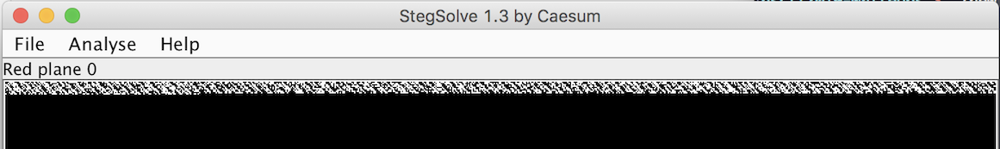

# Logo Sucks Bad
Forensics

## Challenge 
This logo sucks bad.

## Solution

If we use StegSolve, we see some data bits hidden at the LSB plane

Use online tool to extract LSB message

- https://stylesuxx.github.io/steganography/

## Flag

	hsctf{th4_l3est_s3gnific3nt_bbbbbbbbbbbbb}
