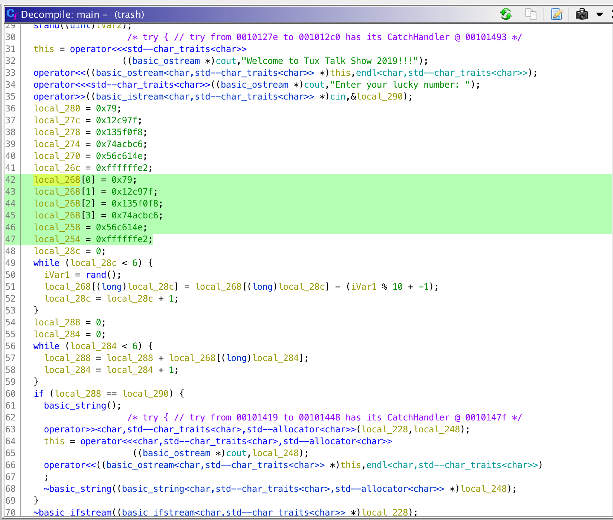

# Tux Talk Show 2019
Reversal

## Challenge 

Tux Talk Show 2019. Yes, this is trash.

nc rev.hsctf.com 6767

[trash]

## Solution

Decompile in Ghidra

Psuedocode

	main() {
	  srand(time(0)); // seed random no. on current time
	  cout << ""Enter your lucky number: "
	  cin >> local_290;

	  local_280 = 0x79;
	  local_27c = 0x12c97f;
	  local_278 = 0x135f0f8;
	  local_274 = 0x74acbc6;
	  local_270 = 0x56c614e;
	  local_26c = 0xffffffe2;

	  // array
	  local_268[0] = 0x79;
	  local_268[1] = 0x12c97f;
	  local_268[2] = 0x135f0f8;
	  local_268[3] = 0x74acbc6;
	  local_268[4] = 0x56c614e;
	  local_268[5] = 0xffffffe2;
	  
	  // subtract a random no. from 1 to 10 inclusive.
	  for (int i = 0; i < 6; i++) {
	  	iVar1 = rand();
	  	local_268[i] -= (iVar1 % 10 + -1);
	  }

	  // Sum up all numbers
	  local_288 = 0;
	  for (int i = 0; i < 6; i++) {
	  	local_288 += local_268[i];
	  }

	  if (local_288 == local_290) {
	    basic_string();
	    cout << flag;

	                    /* try { // try from 00101419 to 00101448 has its CatchHandler @ 0010147f */
	    operator>><char,std--char_traits<char>,std--allocator<char>>(local_228,local_248);
	    this = operator<<<char,std--char_traits<char>,std--allocator<char>>
	                     ((basic_ostream *)cout,local_248);
	    operator<<((basic_ostream<char,std--char_traits<char>> *)this,endl<char,std--char_traits<char>>)
	    ;
	    ~basic_string((basic_string<char,std--char_traits<char>,std--allocator<char>> *)local_248);
	  }
	}

From the code, we see that there is an array declared with numbers.

First, the array will have random numbers being subtracted (1 to 10 inclusive). The random seed is based on current time.

After which, they are summed together.

We can create a program in C that seeds the current time and then outputs the final result.

If we do it fast enough and feed directly to the server, we should be able to get the flag.

	# gcc solve.c -o solve && ./solve | nc rev.hsctf.com 6767
	Welcome to Tux Talk Show 2019!!!
	Enter your lucky number: hsctf{n1ce_j0b_w4th_r4ndom_gue33ing}

## Flag

	hsctf{n1ce_j0b_w4th_r4ndom_gue33ing}
